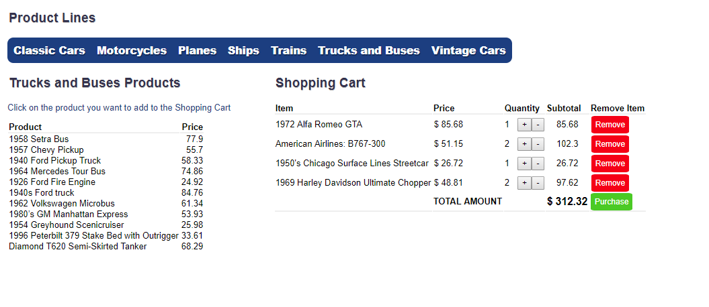

# React.js Shopping Cart Full-Stack

Shopping Cart application in React.js with persistence data using Node.js and MariaDB for the back end.
Users can select between product lines by clicking on the navigation bar and add items to the shopping cart also by clicking in the items displayed on each product line.

